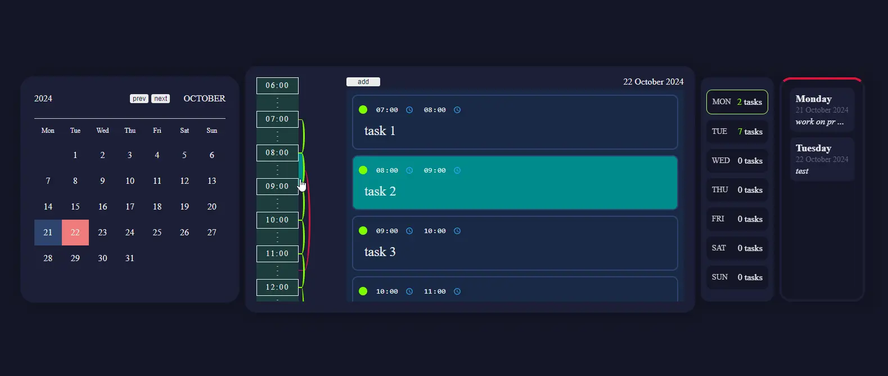

# Use-calendar (web-app)

### Video preview:

### Server repository:
https://github.com/ghstd/calendar

### Website:
https://use-calendar.firebaseapp.com/

### Description:
The service is a calendar-diary with the ability to leave notes, add a schedule for each day, highlight important tasks, has a graphical display of the schedule with the ability to search.

### Resources used:
- https://firebase.google.com
- https://render.com
- https://jsonbin.io -> Database
